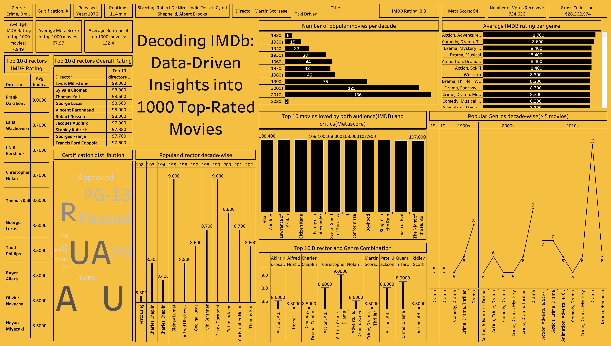

# **Decoding IMDb: Data Driven Insights into 1000 Top Rated Movies**

## Objective
To analyze the top 1000 IMDb movies using SQL and Tableau to uncover trends in movie ratings, genres, directors, and audience preferences over the decades.

The dataset was collected from Kaggle [IMDb top 1000 movies dataset](https://www.kaggle.com/datasets/harshitshankhdhar/imdb-dataset-of-top-1000-movies-and-tv-shows)

## SQL (MySQL)
MySQL was used to first analyse, the clean the raw dataset and then extract KPIs (Key Performance Indicators) queries from the dataset, which were then exported to Tableau to create the visualisation.

[Link to the SQL queries file](https://raw.githubusercontent.com/aayushmanmukherjee/IMDB_Top_1000_Movies_Analysis/main/imdb_movies_queries.sql)

## Tableau
Tableau public software was used to analyse and visualise the various queries made in SQL and answer questions from the dataset.

Questions answered from the dataset includes - 
- Top 10 movies loved by audience.
- Top 10 directors by overall ratings (imdb rating + metascore).
- Top 10 directors by imdb ratings.
- Top 10 director + genre combinations.
- Number of popular movies (in top 1000 movies) per decade .
- Most popular genres of each decade.
- Most popular director of each decade.
- Genre wise imdb ratings.

### The Tableau Dashboard

[Link to the Tableau public dashboard](https://public.tableau.com/views/imdb_top_1000_dashboard/Dashboard1?:language=en-US&:sid=&:redirect=auth&:display_count=n&:origin=viz_share_link)

## Conclusions

- The 2000s and 2010s produced the highest number of top-rated movies, showing a strong surge in global film production and audience engagement during these decades.
- Action and Comedy-Drama genres consistently received the highest IMDb ratings.
- Highest rated director as per imdb rating is Frank Darabont and highest rated director overall (imdb ratings + metascore) is Lewis Milestone.
- The "A" and "U" certifications almost equally dominate among top movies, suggesting that most acclaimed films appeal to a wide audience range.
- Christopher Nolan stands out in the top director + genre combinations with 3 genres standing out with, which are - Action, Adventure and Sci-fi; Action, Crime and Drama; and Adventure, Drama and Sci-fi.

## All the important links
- [SQL file link](https://raw.githubusercontent.com/aayushmanmukherjee/IMDB_Top_1000_Movies_Analysis/main/imdb_movies_queries.sql)
- [Tableau public dashboard link](https://public.tableau.com/views/imdb_top_1000_dashboard/Dashboard1?:language=en-US&:sid=&:redirect=auth&:display_count=n&:origin=viz_share_link)
